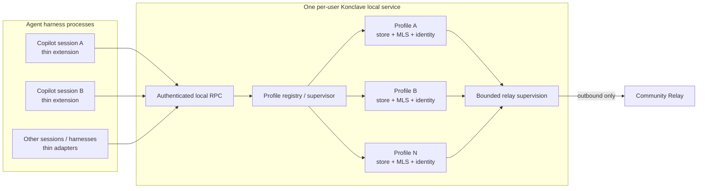
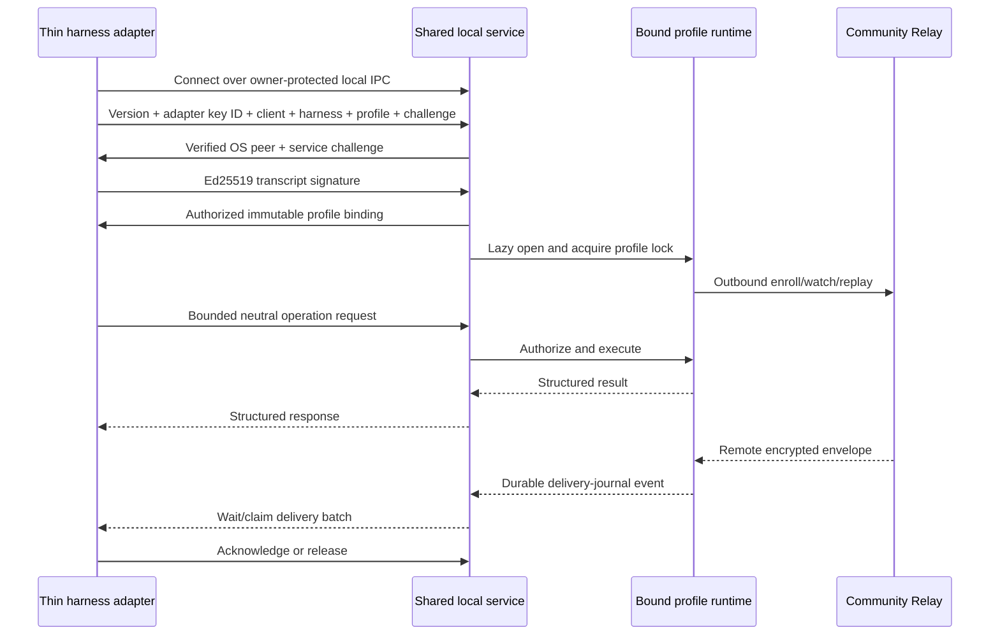
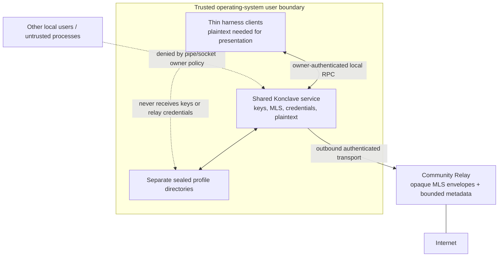

# Host logical agent profiles in one per-user local service

## Context and scope

Konclave is intended to provide durable communication among many concurrently active
agent sessions. The Copilot MVP attached one locked profile to one
`KonclaveLocalDaemon` child launched as a stdio MCP server by each Copilot CLI
session. That model isolated profiles quickly and proved pairing, encrypted messaging,
relay enrollment, crash recovery, and automatic delivery.

It does not scale to the actual workstation usage pattern. An operator may keep more
than twenty Copilot CLI sessions active at once. The MVP model would therefore create
more than twenty Rust daemons, SQLite/MLS owners, pairing supervisors, relay clients,
and MCP transports in addition to the harness and extension processes.

ADR 0005 selected a daemon-to-adapter connection and native harness MCP child for the
MVP. ADR 0007 explicitly rejected a long-lived multi-profile service because it
required a new local authorization and lifecycle model beyond distribution scope.
Those were valid scope decisions for proving behavior. They are not an acceptable
operating model for the product.

This decision owns the local process model, multi-profile service boundary, client
connection direction, local authentication, profile registration, harness adapter
responsibilities, upgrade migration, and service lifecycle. It does not change MLS,
conversation authorization, relay data-plane authentication, enrollment, sealed
profile storage, or remote relay deployment.

## Verified facts

- Copilot CLI launches one extension process per foreground session. Konclave cannot
  consolidate that harness-owned process lifecycle, so each extension must remain a
  thin client.
- The current extension declares one stdio MCP server whose command is
  `KonclaveLocalDaemon`. Copilot therefore launches one daemon process per session.
- The local two-session smoke proved the protocol while launching two separate daemon
  children. It demonstrates behavior, not acceptable process scaling.
- `LockedProfile::acquire` locks one profile directory, not one process globally. One
  process can safely acquire distinct locks for distinct profile directories.
- Each `ProfileStore`, `SealedSqliteMlsStorage`, `ConversationCoordinator`,
  `ApplicationService`, `PairingService`, relay client, and delivery journal is already
  shaped around one profile. These units can be hosted repeatedly in one process
  without combining profile cryptographic or persistence state.
- The current runtime joins one profile's relay service, pairing supervisor, stdio MCP
  server, adapter loop, and shutdown future. That task set is a reusable per-profile
  runtime once process-global environment configuration is removed.
- Stdio binds one MCP client to one child process and has no profile multiplexing.
  It cannot be the normative service transport.
- Platform packaging already contains one Windows service host, systemd unit, and
  launchd job, but each currently reads one profile from process environment.
- The existing authenticated adapter framing is bounded and profile-aware, but its
  connection direction and request vocabulary are specific to the MVP delivery
  rendezvous.
- Windows named pipes and Unix-domain sockets can enforce owner-only local access
  without opening an internet or loopback TCP listener.

## Assumptions

- The operating-system account and active process memory remain trusted as defined by
  the threat model. Cross-user local access is not trusted.
- A Copilot, Claude, Codex, or other harness session has a stable bounded identifier
  that its adapter can map to one durable Konclave profile identifier.
- Distinct agent sessions may require distinct `DeviceId`, MLS membership, relay
  principal, profile database, and crash journal even though one service process hosts
  them.
- Native platform peer credentials can identify the connecting operating-system user,
  but operating-system identity alone does not authorize a profile.
- Each installed harness adapter has a registered Ed25519 client identity whose
  private key remains in owner-protected adapter custody and whose public authorization
  record is held by the service.
- The Community Relay remains independently deployable and reachable only through
  outbound client connections.
- Some compatibility period is necessary because installed extensions and daemon
  versions cannot change atomically on every machine.

## Decision drivers

- A bounded process, handle, memory, database, and relay-connection footprint with
  dozens of concurrent agent sessions.
- No core dependency on Copilot CLI, MCP, prompts, models, or one harness lifecycle.
- Independent cryptographic and persistence identity for each logical profile.
- One reusable local client boundary for agent tools, slash commands, automatic
  delivery, administration, and future harnesses.
- Owner-authenticated local IPC with no internet-facing or loopback TCP listener.
- Crash-safe profile lifecycle and failure isolation inside one long-lived process.
- Idempotent installation, upgrade, rollback, reconnect, and client churn.
- A migration path that preserves existing profiles and relay principals.

## Decision

### Run one per-user local service

Konclave installs and runs one local service process per operating-system user. The
service is the only local process that:

- opens profile stores and MLS databases;
- loads or creates profile wrapping keys and device identities;
- handles application plaintext and membership state;
- owns relay credentials, enrollment, replay, watch, and acknowledgment;
- supervises pairing, message, delivery-journal, and recovery tasks; and
- accepts authenticated local client connections.

Harness sessions never spawn `KonclaveLocalDaemon`. A session starts only its
harness-required thin adapter process and connects that adapter to the shared service.
Service shutdown is independent of any one harness session.

### Preserve profile isolation inside the process

The service owns a registry keyed by validated `ProfileId`. Opening a profile:

1. resolves one profile directory under the configured root;
2. acquires that profile's existing non-blocking exclusive lock;
3. loads that profile's sealer, application store, MLS store, identity, relay
   configuration, and recovery journals;
4. creates one per-profile runtime task set; and
5. binds the requesting client connection to that exact profile.

Profiles never share SQLite connections, MLS state, device identities, relay
credentials, sealed blobs, counters, journals, or adapter leases. Hosting profiles in
one process is process consolidation, not data multi-tenancy inside one database.

One profile failure is reported to its clients and supervisor. It does not silently
terminate unrelated profiles. Process-wide failures still fail the service and are
recovered through ordinary service restart and per-profile journals.

### Use a versioned harness-neutral local RPC

The normative local client boundary is a bounded, versioned request/response and
delivery protocol over:

- an owner-restricted named pipe on Windows; and
- a socket inside an owner-only runtime directory on Unix and macOS.

The service listens on one well-known per-user local endpoint. This is local IPC, not
internet-facing inbound connectivity. It never opens a loopback or non-loopback TCP
listener.

The service verifies the peer operating-system user through the platform transport and
restricts the endpoint ACL or filesystem ownership to that user. This rejects other
accounts but does not by itself authorize profile access.

Installation registers one Ed25519 client public key for each harness adapter. The
authorization record contains a random adapter identifier, finite harness kind,
allowed profile namespace, status, and key version. The adapter stores the matching
private key in an ordinary-file boundary with the same owner, permission, link, and
reparse-point requirements as other local capabilities. The private key never enters
arguments, environment variables, logs, telemetry, service configuration, or profile
storage.

A connection performs a replay-resistant signature handshake that binds:

- protocol version;
- registered adapter identifier and key version;
- client instance identifier;
- harness kind;
- requested profile identifier; and
- fresh challenges from both peers.

The adapter signs the canonical transcript with its registered private key. The service
loads the matching active public record, verifies the signature, requires the
transport peer to match the registered operating-system account, checks the harness
kind and profile namespace, and returns a service proof over the same transcript. A
replayed signature fails because both connections contribute fresh challenges.

Registration is an explicit installation operation. It is not available through the
ordinary client endpoint. Rotation registers a new key version before retiring the old
one; revocation immediately rejects new attaches and closes active connections for
that adapter identifier. Uninstall revokes the adapter record and removes its private
key by exact path. A reconnect uses the same registered key but a fresh client instance
and challenges.

The profile binding is immutable for the life of the connection. A client cannot
switch profiles by changing a request field. A second active consumer for a
single-consumer profile fails closed unless the profile policy explicitly permits
multiple clients. Every request has a bounded identifier, finite operation kind,
bounded payload, deadline, and idempotency semantics.

The protocol exposes neutral operations for:

- agent tool invocation;
- deterministic command invocation;
- delivery wait, claim, acknowledge, and release;
- profile/client status and health; and
- explicit client detach.

It contains no Copilot, Claude, Codex, prompt, model, slash-command, or UI types.

### Keep MCP and slash commands as adapter surfaces

MCP remains a supported agent-tool binding, not the process or service transport.
Each harness adapter maps its native tool registration to the neutral local RPC.
Copilot custom tool handlers call the shared client; Claude Code, Codex, or another
harness may use a different registration mechanism over the same client contract.

Deterministic slash commands call the same shared client directly. They do not prompt a
model and do not create a second daemon or profile owner.

The daemon does not discover or implement slash commands. Command names, argument
parsing, display text, and harness UI stay in the adapter.

### Preserve automatic delivery semantics

The service retains ADR 0005's durable profile-global event journal and
wait/claim/lease/acknowledge/release semantics. Delivery eligibility, mute behavior,
stable notification identifiers, bounded batches, lease generations, crash recovery,
and at-least-once harness delivery remain profile-owned.

The thin adapter maintains one attached delivery consumer for its bound profile and
maps accepted events into its harness. Disconnect makes unacknowledged claims
reclaimable. Reconnect with the same durable harness session identifier reattaches to
the same profile but receives a fresh client instance and connection binding.

### Bound profile and client lifecycle

The registry opens profiles lazily. It retains an active profile while any client,
delivery lease, pairing operation, relay recovery operation, or configured retention
policy requires it.

An idle profile may be evicted only after:

- every client has detached or expired;
- no claim or operation is active;
- database checkpoints and task shutdown complete; and
- the exclusive profile lock is released.

Eviction removes no durable profile data or native key. Explicit profile retirement
and deletion are separate authorized operations with their own confirmation and
retention policy.

### Install and supervise the service independently

Windows uses one per-user service or owner-session background service. Linux uses one
systemd user unit. macOS uses one launchd agent. All run the same multi-profile service
entry point and configuration.

The installer owns service start, stop, health, upgrade, and rollback. Thin extensions
contain no daemon binary after migration. `konclave init` configures installation and
enrollment; `doctor` checks the shared service and local client path.

The service may start eagerly through the platform supervisor or lazily through an
idempotent installer-owned launcher. Concurrent client starts must converge on one
service instance.

Installation also creates the adapter client identity, registers its public
authorization with the service through an installer-owned administrative path, and
writes the private key only into the thin adapter's owner-protected state. Ordinary
service clients cannot create or broaden adapter registrations.

### Migrate without a selectable per-session fallback

The first shared-service package never launches `KonclaveLocalDaemon` from a harness
session. A new thin client that cannot reach or negotiate with the shared service fails
visibly and directs the operator to installation repair. It does not silently or
explicitly select per-session spawning.

Old-version sessions already running during upgrade may drain under their old process
model for a bounded documented upgrade window. New sessions use only the shared
service. The installer detects old daemon children, prevents new old-version launches,
and requires them to exit before deleting compatibility binaries. Rollback installs
the complete prior package; it is not a runtime mode in the new adapter.

Existing native-custody profile directories, wrapping keys, device identities, relay
principals, conversation state, and journals require no data conversion because the
shared service uses the same profile storage contract.

External-custody profiles require explicit migration of their profile-scoped provider
configuration. A service-readable non-secret record identifies the approved external
source, while the secret remains in an owner-protected secret mount, inherited
platform-supervisor descriptor, or equivalent custody provider. An old profile whose
external source existed only in a per-session process environment or ephemeral
descriptor fails closed until the operator rebinds that source. It never falls back to
native custody, plaintext configuration, or another profile's provider.

Compatibility removal requires packaged upgrade and rollback evidence plus a scale
test proving that supported harnesses no longer launch daemon children.

## Trust boundaries

The adapter receives plaintext required to present messages or tool results, but it
never receives MLS private keys, provider state, wrapping keys, enrollment
credentials, or relay bearer credentials. The service remains the only process
boundary that owns those secrets.

## Serious alternatives

### Keep one stdio daemon per harness session

**Pros:** strongest process isolation, native MCP lifecycle, and already proven.

**Cons:** process, memory, handle, database, supervisor, and relay cost grows directly
with every open agent session. More than twenty normal sessions create an unacceptable
workstation footprint. Rejected.

### Let each extension own one daemon through an MCP client

**Pros:** deterministic slash commands and agent tools can share one client library.

**Cons:** it merely moves ownership from Copilot to the extension and still creates one
daemon per session. It also replaces harness-native MCP with proxied custom tools.
Rejected.

### Run one shared loopback HTTP MCP server

**Pros:** existing MCP clients can connect without custom tool adapters and one process
can serve many sessions.

**Cons:** makes MCP the normative core boundary, introduces a loopback network listener,
complicates per-session authentication, and constrains non-MCP harnesses. Rejected.

### Use one machine identity and profile for every session

**Pros:** smallest storage and relay footprint.

**Cons:** collapses independently authorized participants, prevents same-machine
sessions from holding distinct conversation roles, couples unrelated crash journals,
and expands compromise and revocation blast radius. Rejected.

### Put all session state in the hosted relay

**Pros:** no local service lifecycle.

**Cons:** violates local key/plaintext custody, offline recovery, self-hosting, and
end-to-end encryption boundaries. Rejected.

## Consequences

### Positive

- Daemon process count is constant as agent session count grows.
- Heavy cryptographic, database, relay, and recovery infrastructure is shared at the
  process level while profile state remains isolated.
- Agent tools, deterministic commands, delivery, administration, and future harnesses
  share one neutral local client.
- Harness adapters stay thin and contain no keys or relay credentials.
- MCP becomes replaceable rather than architectural.
- Platform service supervision provides one durable lifecycle independent of any
  harness session.

### Negative

- The local service becomes a multi-profile supervisor whose crash affects every
  active profile on that account.
- Local IPC authentication, routing, backpressure, fairness, idle eviction, versioning,
  migration, and compatibility become security-sensitive core responsibilities.
- A shared process has a larger in-memory plaintext and secret blast radius than one
  profile process, even though the operating-system account was already trusted.
- Packaging and upgrade coordination become more complex.
- Native harness MCP convenience is replaced by adapter-owned tool registration.

### Neutral

- Profiles retain separate identities, principals, databases, locks, and recovery
  journals.
- The Community Relay remains unchanged and sees no plaintext.
- Enrollment remains per profile and uses the existing install-scoped authority.
- The harness still owns one lightweight adapter process per session when its extension
  model requires that process.
- Hosted service implementation and billing remain outside this decision.

## Confirmation

Continued compliance is demonstrated by:

- tests that one process opens and supervises at least twenty distinct locked profiles;
- process-tree assertions proving twenty clients create exactly one service PID and no
  per-session daemon children;
- cross-profile isolation tests for databases, sealers, identities, relay principals,
  counters, journals, failures, and authorization;
- wrong-user, wrong-profile, wrong-version, replayed-handshake, endpoint-squatting,
  malformed-frame, oversized-frame, revoked-adapter, wrong-key-version,
  wrong-harness, unauthorized-profile-namespace, duplicate-consumer, and stale-client
  rejection on Windows and Unix;
- executed Windows named-pipe owner/DACL and Unix socket owner/mode/link tests;
- adapter registration, rotation, revocation, reconnect, key-file ownership/link, and
  exact uninstall tests;
- client churn, duplicate attach, reconnect, idle eviction, service crash/restart, and
  profile recovery tests;
- pairing and exact bidirectional messaging through thin Copilot clients;
- automatic delivery claim/release/acknowledgment tests across client and service
  crashes;
- install, upgrade, rollback, and existing-profile migration acceptance on every
  supported platform;
- migration tests for native-custody profiles and explicit rebind/fail-closed tests for
  external-custody profiles;
- package assertions that thin extensions contain no daemon binary after the
  old-version drain window; and
- conformance fixtures that exercise the neutral local RPC without Copilot CLI.

## References

- [ADR 0002: Sealed local secret custody](adr-0002-sealed-local-secret-custody.md)
  defines the native/external key providers that remain per profile inside the service.
- [ADR 0003: Relay transport authentication](adr-0003-relay-transport-authentication.md)
  defines per-profile relay principals and outbound bearer transport that do not change.
- [ADR 0004: Daemon profile journal](adr-0004-daemon-profile-journal.md) defines the
  per-profile lock, split-schema storage, sealing, and crash recovery that the registry
  must preserve.
- [ADR 0005: Harness-neutral adapter boundary](adr-0005-harness-neutral-adapter-boundary.md)
  is superseded because its delivery semantics remain valid but its per-session process
  ownership and daemon-to-adapter rendezvous no longer scale.
- [ADR 0006: Joiner-issued pairing capabilities](adr-0006-joiner-issued-pairing-capabilities.md)
  remains the pairing authorization contract exposed through the new local RPC.
- [ADR 0007: Outbound relay principal enrollment](adr-0007-outbound-relay-principal-enrollment.md)
  remains the enrollment decision; its rejection of a shared daemon was an explicit MVP
  scope tradeoff now revisited by this record.
- [Threat model](../security/threat-model.md) defines the trusted local account,
  untrusted relay, credential, endpoint, and plaintext disclosure boundaries.
