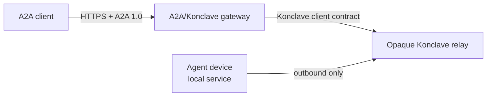

# Expose A2A through an edge gateway without replacing Konclave transport

## Context and scope

Konclave provides private, asynchronous communication among independently running
agent sessions. Its public protocol owns device identity, MLS end-to-end encryption,
membership authorization, durable ordered relay delivery, replay protection, sealed
endpoint custody, and exact directed-request handling.

The Linux Foundation Agent2Agent protocol (A2A) addresses a different layer. It
defines how otherwise opaque agent systems advertise capabilities and exchange
messages, tasks, status, parts, and artifacts through standard web protocol bindings.
It deliberately relies on deployment-provided web authentication and does not define
Konclave's endpoint custody, MLS membership, durable relay, or local policy model.

Konclave needs A2A interoperability without replacing its stronger communication
invariants, exposing the local daemon to inbound network traffic, or making the
managed service the only complete implementation. It also needs to state where
plaintext terminates: a conventional A2A bridge cannot claim end-to-end
confidentiality between the original A2A client and a Konclave device when the bridge
must translate A2A content.

This decision owns:

- A2A's architectural position relative to Konclave;
- the public self-hosted and managed-service boundary;
- the initial A2A feature and content profile;
- task and identity projection rules;
- standard versus end-to-end-protected trust claims;
- the disposition of AGNTCY SLIM; and
- the source of A2A wire contracts.

It does not freeze exact Rust APIs, HTTP framework selection, database schemas,
deployment topology, UI design, prices, quotas, or implementation order.

## Verified facts

- A2A has a stable protocol 1.0 specification. The latest repository release at this
  decision is v1.0.1, while its interfaces advertise protocol version `1.0`.
- A2A's normative data model is Protocol Buffers. The released
  `specification/a2a.proto` defines Agent Cards, messages, parts, artifacts, tasks,
  task states, extensions, security schemes, and binding-neutral operations.
- A2A defines JSON-RPC, gRPC, and HTTP/REST bindings. Its web model supports
  synchronous responses, streaming, and asynchronous long-running tasks.
- A2A messages may contain multiple text, raw-byte, URL, or structured-data parts.
  Several fields use `google.protobuf.Struct`, so accepting the generated DTO does not
  establish Konclave's allocation, semantic, or trust invariants.
- A2A Agent Cards advertise interfaces, capabilities, skills, and security
  requirements. The schema can carry JWS signatures, but the signatures collection
  itself is optional.
- A2A task roles describe requester and agent direction. Konclave conversation roles
  describe membership authority. They are not interchangeable.
- ADR 0012 defines one Konclave `DirectedRequest` as one exact target and one bounded
  body. Its terminal response is ordinary text referencing the request message.
- ADR 0001 and the protocol compatibility contract require MLS-authenticated sender
  attribution, fixed identifiers, per-sender replay protection, opaque relay
  metadata, ordered durable cursors, and one public protocol across deployments.
- ADR 0008 requires the local agent service to expose owner-restricted local IPC only.
  Agent devices do not accept loopback or internet-facing TCP connections.
- The current SLIM work item is an Informational IETF Internet-Draft,
  `draft-mpsb-agntcy-slim-02`. It describes an MLS-capable transport for protocols
  such as A2A and MCP, but does not specify Konclave-equivalent durable ordered
  delivery, contiguous acknowledgment, application replay protection, device
  credential binding, or sealed endpoint custody.

## Assumptions

- A2A is the primary public application-level interoperability target for
  cross-vendor agent tasks, but other bindings may remain relevant.
- A conventional A2A client expects an HTTP-accessible server and does not implement
  Konclave's MLS, identity, or relay protocol.
- Self-hosters may run an internet-facing gateway, but the agents behind it still
  require outbound connectivity only.
- Managed and self-hosted deployments can share public A2A behavior even when their
  account, storage, routing, and operations implementations differ.
- The first useful profile can be text-only and non-streaming. Advertising fewer
  capabilities truthfully is preferable to approximating unsupported semantics.

## Decision drivers

- Interoperate with the leading cross-vendor agent task protocol.
- Preserve Konclave's E2EE, delivery, replay, membership, and custody guarantees.
- Keep every agent device outbound-only and the local daemon off the network.
- Keep unbounded or semantically ambiguous A2A fields outside Konclave core types.
- Offer a complete, testable, self-hosted public implementation.
- Allow a managed implementation to differentiate through operations rather than
  withheld protocol capability.
- Make trust termination and unsupported behavior explicit.
- Avoid coupling Konclave core to one A2A SDK or web framework.

## Decision

### Treat A2A as an edge application binding

Konclave adopts A2A protocol 1.0 as an optional public interoperability binding.
A2A does not replace the Konclave application protocol, relay envelope, MLS engine,
identity, local RPC, collaboration policy, or durable delivery state.

The integration is a separate gateway at the network edge:

The gateway is a Konclave endpoint and an A2A server. It accepts inbound A2A traffic,
validates and projects it into a Konclave directed request, and observes the
authoritative response through normal Konclave delivery. The agent device opens no
inbound network listener. A self-hoster may place the gateway on any suitable host;
the local agent and gateway need not share a machine or trust boundary.

The gateway uses a public client/service contract. It never opens profile SQLite,
MLS provider state, wrapping keys, or daemon internals directly.
Gateway device enrollment, conversation membership, and target assignment are
explicit deployment configuration rather than authority supplied by an A2A caller.

### Define a strict initial A2A profile

The initial public profile exposes:

- one bounded Agent Card for one configured gateway agent;
- `SendMessage` for starting one task;
- `GetTask` for observing that task; and
- protocol version `1.0`.

The Agent Card declares streaming, push notification, and extended-card capabilities
as unsupported. The gateway does not expose cancellation, task subscription, raw
files, URL fetching, structured-data parts, generated UI, artifacts, or required
extensions until each has a separate bounded semantic mapping.

One accepted request contains exactly one non-empty UTF-8 text part within Konclave's
directed-request body limit. Unsupported or ambiguous part combinations fail with an
A2A protocol error; they are never flattened, fetched, silently truncated, or
reinterpreted.

Non-empty arbitrary metadata and unknown required extensions do not cross the
Konclave boundary. A later profile may define an allowlisted bounded projection.
Generated A2A DTOs remain untrusted wire objects regardless of upstream validation.

### Project A2A tasks onto directed requests

The gateway owns a durable task projection:

- one A2A task ID maps to one Konclave directed-request message ID;
- one A2A context ID maps to a gateway-owned conversation binding;
- requester/agent direction is task metadata and never maps to Konclave
  administrator/member authority;
- `SUBMITTED` means the gateway durably accepted the task;
- `WORKING` means the directed request is durably sent or observed as claimed;
- `COMPLETED` requires one authoritative ordinary-text response from the exact target;
- local validation, authorization, expiry, and transport failures map to explicit
  terminal A2A failure or rejection outcomes.

The gateway does not infer completion from unrelated text or another conversation
member. It does not expose arbitrary profile aliases, conversation IDs, device IDs,
policy digests, or relay routes as caller-selectable tenant fields. Deployment
configuration or an authenticated registry route selects the published agent and
target.

Cancellation is initially unsupported rather than falsely reported. A future
best-effort cancellation feature cannot claim that it retracts an already delivered
Konclave request without a separately specified Konclave cancellation primitive.
The initial profile likewise does not emit `INPUT_REQUIRED` or `AUTH_REQUIRED`;
interrupted multi-turn tasks require a later mapping that preserves ADR 0012's
explicit new-request boundary.

The public self-hosted reference stores these projections in SQLite. Managed
deployments may use another store while preserving the same state and idempotency
semantics.

### Keep discovery bounded and deployment-owned

The public Agent Card contains only deployment-approved A2A metadata:

- a public agent name and description;
- supported A2A interfaces and protocol versions;
- the strict capability flags and text modalities actually implemented;
- bounded public skills; and
- web-layer security requirements.

It contains no Konclave profile alias, `DeviceId`, conversation membership, active
policy, policy digest, relay principal, internal route, or local-service evidence.

If a deployment signs Agent Cards, it uses a dedicated gateway signing key. Device
root keys and conversation MLS keys are never reused as JSON Web Signature keys or
exposed as signing oracles. Authenticated extended cards and searchable private
discovery remain later public protocol surfaces and managed product capabilities.

### Separate web trust from Konclave trust

The gateway authenticates A2A callers with deployment-selected standard web
mechanisms and authorizes them before selecting a Konclave target. This web identity
does not become a `DeviceId`, MLS credential, conversation role, or collaboration
policy authority.

In the standard bridge mode, the gateway necessarily sees A2A request and response
plaintext while translating it. Konclave E2EE begins and ends at Konclave members,
including the gateway. Documentation and Agent Cards must not claim original
A2A-client-to-agent E2EE in this mode.

An optional end-to-end-protected A2A profile may later carry opaque
Konclave-protected content between Konclave-capable A2A peers. That profile requires
its own public specification, negotiation, identity binding, downgrade protection,
and conformance evidence. It cannot be implied by standard A2A transport security or
implemented as an undocumented vendor extension.

### Generate wire DTOs from a pinned canonical release

The public integration vendors the Apache-2.0 A2A schema from an exact upstream
release, records its source and digest, and generates binding DTOs. Generated files
are not hand-edited.

A2A wire DTOs live in a dedicated boundary package or crate. They do not enter
Konclave protocol contracts or domain core. Project-owned validated projection types
enforce limits and supported combinations before creating a Konclave request.

The reference gateway may reuse existing HTTP and Protocol Buffer dependencies, but
Konclave core does not depend on an official A2A runtime SDK, server framework, or
`google.protobuf.Struct` representation. An SDK can be reconsidered when its
dependency, lifecycle, and validation behavior provide a concrete advantage without
weakening this boundary.

### Retain Konclave transport and defer SLIM

Konclave retains its current relay, MLS provider, identity, delivery, replay, and
secret-custody stack.

SLIM is monitored as a potential future transport bridge, not adopted as a core
dependency. A bridge requires concrete interoperability demand and a separate ADR
proving that durable ordering, offline delivery, acknowledgment, replay, route
opacity, membership authorization, and endpoint custody remain equivalent. Sharing
MLS as a primitive is not sufficient.

Konclave may contribute its durable delivery experience to SLIM upstream, but no
SLIM-specific compatibility layer belongs in core before those requirements exist.

### Preserve public self-hosting parity

The public repository owns every client-visible behavior needed for either
deployment:

- the A2A profile and generated contract provenance;
- validation and A2A-to-Konclave task mapping;
- the reference gateway;
- the SQLite task projection store;
- Agent Card generation and optional dedicated-key signing;
- web-authentication extension points;
- self-host packaging and configuration;
- trust-mode documentation; and
- conformance tests, including the upstream A2A compatibility kit.

A managed implementation may remain private and owns operational differentiation:

- accounts, organizations, and identity federation;
- managed registry search and administration;
- tenant routing and isolation implementation;
- highly available distributed task storage;
- regional placement and global routing;
- quotas, billing, abuse controls, and support;
- monitoring, incident response, compliance, and service objectives.

The same public A2A client behavior and Konclave security semantics apply in both
deployments. Moving between self-hosted and managed service changes endpoint,
configuration, and credentials, not message meaning or required capabilities.
Managed-only extensions cannot be required for baseline interoperability.

## Serious alternatives

### Replace Konclave protocol or relay with A2A

**Pros:** fewer public protocol names and direct alignment with A2A SDKs.

**Cons:** A2A does not define Konclave's MLS membership, relay opacity, ordered
durable cursors, application replay protection, sealed endpoint custody, or
device-local policy. Replacing those layers would remove accepted security and
offline-delivery guarantees. Rejected.

### Expose A2A directly from the local daemon

**Pros:** fewer processes and direct access to profile state.

**Cons:** creates an inbound network listener in the trusted plaintext process,
mixes web caller identity with local profile authority, and makes every agent device
network-addressable. Rejected.

### Adopt SLIM as the Konclave transport

**Pros:** MLS-based transport designed to carry A2A and MCP, broader routing modes,
and an emerging multi-language ecosystem.

**Cons:** the current draft does not provide Konclave-equivalent durable sequencing,
acknowledgment, replay, opaque routing, device credential binding, or endpoint
custody. Its Informational Internet-Draft status is not a stable compatibility
commitment. Rejected for core transport.

### Add an optional SLIM bridge now

**Pros:** early compatibility with SLIM deployments while retaining native Konclave.

**Cons:** adds another identity, routing, dependency, deployment, and conformance
surface without demonstrated user demand, while still requiring Konclave-owned
persistence to recover missing delivery guarantees. Deferred.

### Depend on an official A2A SDK

**Pros:** faster binding implementation and upstream-maintained operation helpers.

**Cons:** imports framework and lifecycle choices into the gateway, leaves
Konclave-specific bounds and trust projection necessary, and can couple updates to
SDK release timing. Deferred in favor of generated canonical DTOs.

### Maintain project-owned duplicate A2A wire models

**Pros:** smallest dependency surface and complete control over represented fields.

**Cons:** creates specification drift, weakens compatibility-kit claims, and
duplicates a normative Apache-licensed schema. Rejected.

### Defer all A2A support

**Pros:** no new gateway, schema, task store, or conformance surface.

**Cons:** leaves cross-vendor users without a standard integration while A2A already
provides a stable task and discovery model that can be isolated at the edge.
Rejected.

## Consequences

### Positive

- Konclave gains a standards-based cross-vendor task interface without weakening its
  protocol or local trust boundary.
- Agent devices remain outbound-only.
- Self-hosters receive a complete reference path rather than a deliberately reduced
  edition.
- Managed service value comes from operation and support rather than incompatible
  semantics.
- A2A wire evolution remains isolated from Konclave core.
- Capability and trust claims remain truthful and testable.
- SLIM can mature independently without forcing a transport migration.

### Negative

- The gateway is an additional deployable component and a plaintext trust endpoint
  in standard bridge mode.
- A2A and Konclave task lifecycles do not align perfectly, so the gateway owns durable
  projection state and explicit failure mappings.
- The initial text-only profile supports less modality and lifecycle breadth than
  A2A permits.
- Generated upstream contracts, compatibility-kit behavior, and schema provenance
  require ongoing maintenance.
- Self-hosters operating a public gateway own web authentication, TLS termination,
  availability, and abuse protection.
- A future protected profile or SLIM bridge needs another security review and ADR.

### Neutral

- Native Konclave peers continue using the existing protocol without A2A.
- MCP remains a tool/data integration protocol and is not replaced by A2A.
- A2A web identities and Konclave device identities remain separate.
- Managed storage and registry internals need not match the SQLite reference
  implementation.

## Confirmation

Continued compliance requires:

- pinned provenance and license records for every vendored A2A schema;
- generated DTO drift checks against the selected upstream release;
- strict boundary tests for identifier, string, collection, part, metadata, and
  extension limits before allocation or Konclave side effects;
- rejection tests for raw bytes, URLs, structured data, multiple parts, unsupported
  operations, unknown required extensions, and caller-selected internal identifiers;
- Agent Card tests proving advertised interfaces, capabilities, modalities, and
  security requirements match implemented behavior;
- signature tests proving any signed card uses a dedicated gateway key and canonical
  JWS processing rather than a Konclave device or MLS key;
- task-store crash and idempotency tests across send, response, restart, and
  conflicting retry boundaries;
- tests proving only the exact targeted device response completes a task;
- tenant and target-isolation tests proving one published agent cannot reach another
  profile or conversation;
- upstream A2A compatibility-kit evidence for every advertised binding;
- network tests proving the gateway accepts configured inbound traffic while agent
  devices and the local daemon remain outbound-only;
- standard-mode tests and documentation proving the gateway is a plaintext trust
  endpoint and does not claim original-client-to-agent E2EE;
- parity tests running the same public client cases against self-hosted and managed
  deployments; and
- a separate accepted ADR before core SLIM adoption, a SLIM bridge, or a protected
  A2A profile changes these boundaries.

## References

- [A2A protocol specification](https://a2a-protocol.org/latest/specification/) —
  defines the task, message, Agent Card, operation, and binding layers adopted at the
  gateway edge.
- [A2A v1.0.1 release](https://github.com/a2aproject/A2A/releases/tag/v1.0.1) —
  identifies the exact current upstream release whose schema advertises protocol
  version 1.0.
- [A2A v1.0.1 normative Protocol Buffer schema](https://github.com/a2aproject/A2A/blob/v1.0.1/specification/a2a.proto) —
  provides the generated wire source and shows that arbitrary structures remain
  untrusted boundary data.
- [A2A Technology Compatibility Kit](https://github.com/a2aproject/a2a-tck) —
  provides external conformance cases for the advertised A2A surface.
- [SLIM Internet-Draft](https://datatracker.ietf.org/doc/draft-mpsb-agntcy-slim/) —
  establishes SLIM's current Informational draft status, MLS transport role, and
  relationship to application protocols such as A2A.
- [ADR 0001](adr-0001-protocol-trust-and-e2ee.md) — requires Konclave-owned identity,
  relay, replay, and application contracts around MLS.
- [ADR 0007](adr-0007-outbound-relay-principal-enrollment.md) — keeps agent
  connectivity outbound-only and separates self-hosted from deployment-specific
  enrollment authentication.
- [ADR 0008](adr-0008-shared-local-service.md) — keeps the local daemon on
  owner-restricted IPC and preserves per-profile isolation.
- [ADR 0012](adr-0012-structured-directed-collaboration-requests.md) — defines the
  exact one-request/one-response primitive projected into an A2A task.
- [Protocol compatibility contract](../protocol/compatibility.md) — owns fixed
  identifiers, bounded wire behavior, ordered durable delivery, replay protection,
  and additive negotiation.
- [Threat model](../security/threat-model.md) — defines remote input, relay, adapter,
  and endpoint trust boundaries that the gateway cannot broaden.
